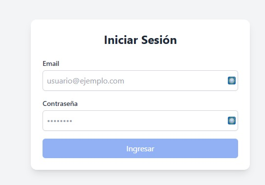
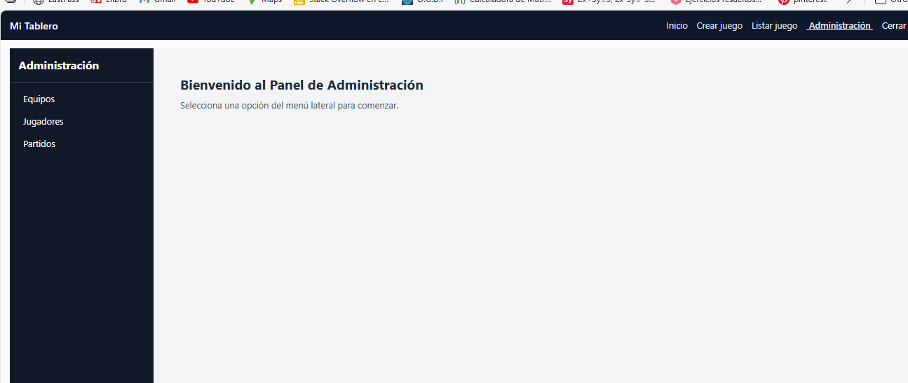
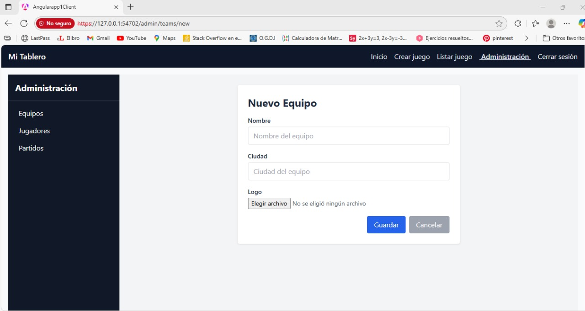
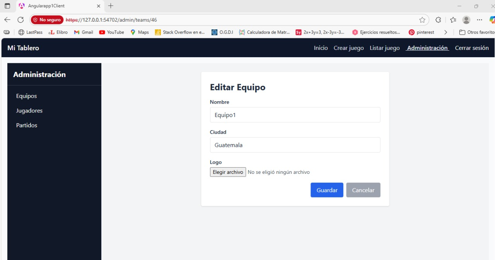
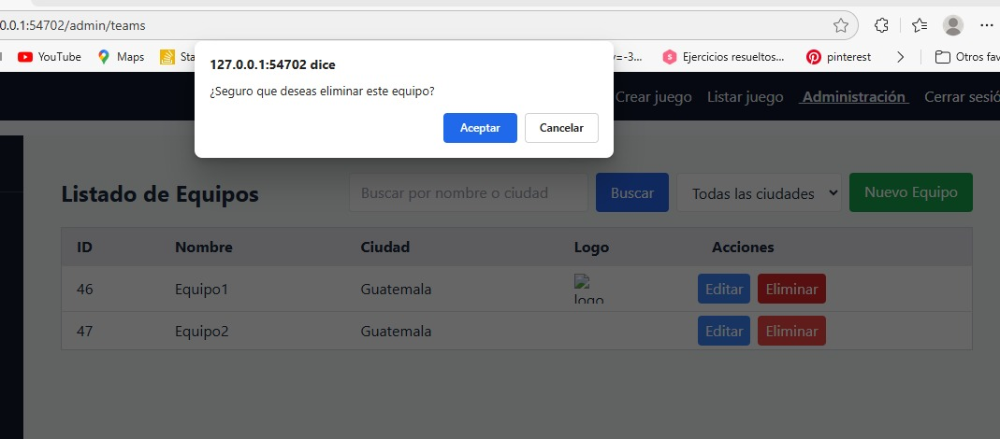
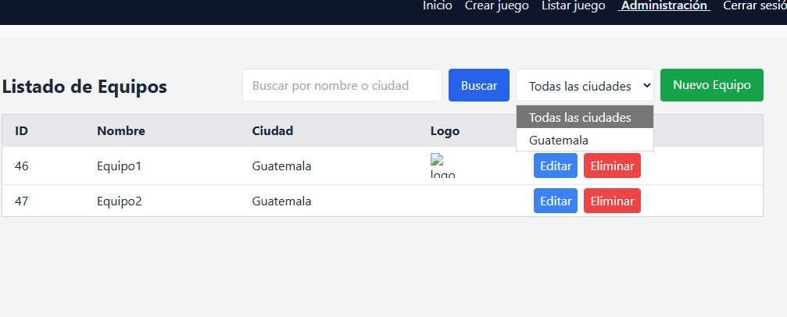
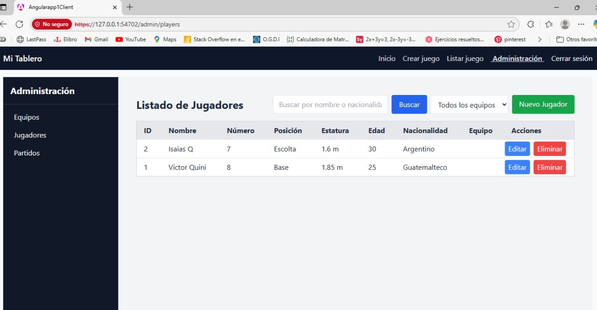
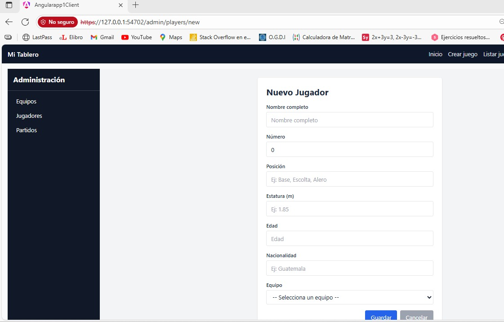
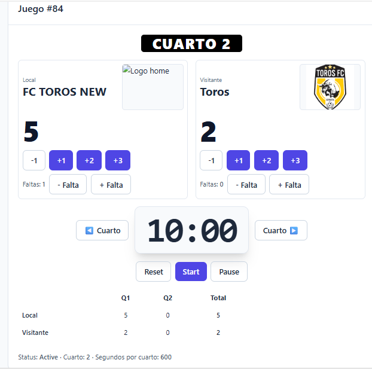
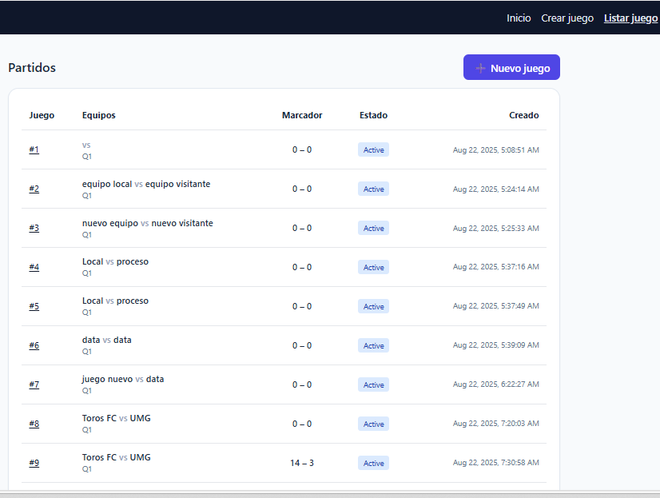

## Vista principal
Inicio de sesion para usuario administrador: 
El usuario debe estar autenticado con permisos para acceder a la parte administrativa 

### Acceso al panel de administracion

El usuario administrador, podra realizar diferentes gestiones(Equipo, Judadores, Partidos)

- Agregar
- Editar
- Eliminar
- Buscar

### Agregar nuevo equipo

- Ingresar nombre del equipo
- Ingresar ciudad 
- Elegir logo
- clic en boton guardar 

### Editar Equipo

- Ingresar nombre del equipo
- Ingresar ciudad 
- Elegir logo
- clic en boton guardar 

### Eliminar Equipo

- clic en el boton eliminar 
- Mensaje de confirmacion
- clic boton aceptar

### Buscar Equipo

- Escribir nombre de equipo/ciudad
- clic boton buscar

### Listado Judadores

- clic en juadores 
- de desplegara lista de judaroes con distintas opciones

### Agregar un jugador

- Elegir la opcion nuevo jugador
- Ingresar Nombre
- Ingresar Numero
- Ingresar Posicion
- Ingresar Estatura
- Ingresar Edad
- Ingresar Nacionalidad
- Ingresar Equipo
- clic en el boton guardar

### Gestionar partido juego

- Clic en listar juego
Muestra en pantalla el panel de control del juego
- Iniciar, pausar, resetear y finalizar partidos
- Agregar y quitar faltas
- Agregar y quitar puntos
- Avanzar cuartos manualmente 
Muestra en pantalla puntos, falta de cada cuarto

### Listar juegos
- Clic en Listar juego
Muestra en pantalla los partidos:
- No. de Juego
- Equipos que jugaron
- Marcador
- Estado del juego (Activo o finalizado)
- Fecha

